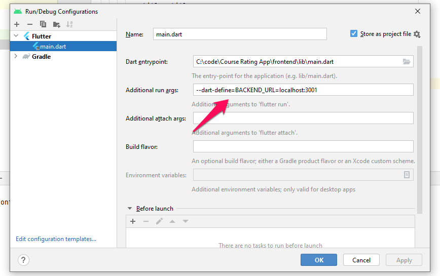

# HOW TO RUN FRONTEND ON LOCAL SYSTEM
## ANDROID STUDIO
1. Open Run-> Edit Conifgurations
2. Modify **additional args** as follows:

## CMD
- RUN `flutter run --dart-define=BACKEND_URL=localhost:3001`
